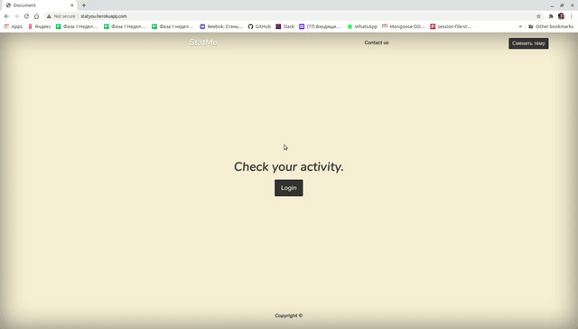

Приложение для составление рейтинга самых активных пользователей определенной группы ВК по лайкам, комментариям и репостам; 
This application helps to make the rating of the most active user of VK.com community by likes, comments and reposts.

### Выбор темы (choose the theme):
Перед началом работы можно выбрать тему приложения (светлую или темную) 
Before start you can choose dark or bright theme of page.

### Аутентификация (authentification):
Перед началом пользования приложением необходимо аутентифицироваться через VKontakte прямо внутри приложения. 
Before using app you should authentificate through vk.com inside our app.

### Начало работы (start):
Далее необходимо вставить в поле ввода "Group/Public link"
адрес интересующей группы, выбрать количество постов, которое надо проанализировать и тип записей, по которым необходимо произвести поиск (лайк, комментарий, репост). 
Input the link  of a groupe you want to analize choose types of note to analize with (like, repost, comment)

В самом верху списка располагается наиболее активный участник группы, нажав на его ID можно перейти на его страницу. 
In the top of the list you can find the most active community user.

Ссылка на приложение (app link): http://statyou.herokuapp.com/

### Над приложением работали (team):

* [Иван Каштанов](https://github.com/kashtn);
* [Денис Эпштейн](https://github.com/DenisEps);
* [Егор Богданов](https://github.com/YegorBogdanov).
